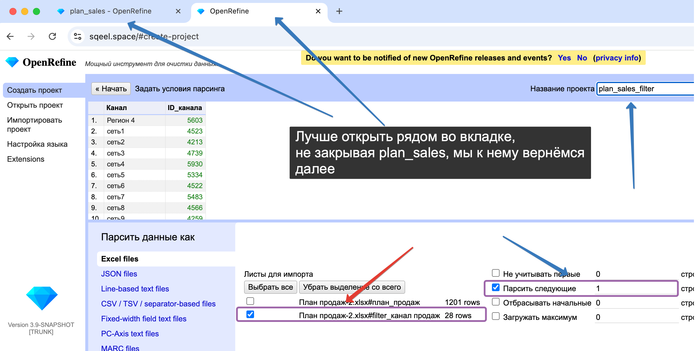
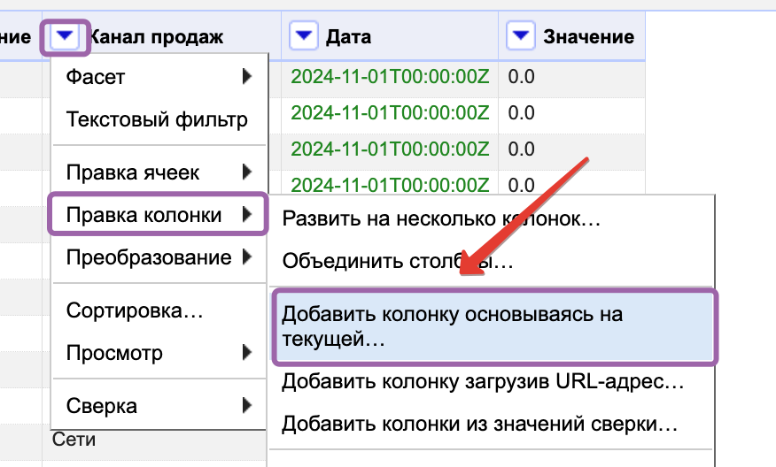

## Создаём проект plan_sales

### Импортируем

- Ставим галочку игнорировать строку со значением 1
- Ставим галочку parse next со значением 2
- Называем проект plan_sales


### Избавляемся от подытогов и некоторых колонок

В самом начале лучше переключить отображение на rows:


Можно по разному избавиться от группировок, но самый простой способ от убрать строки в которых нет id:

- Выбираем ID > Facet > Text facet


- Фильтруем по (blank)


- Удаляем выбранные строки


- Закрываем фильтр по ID


- Удаляем колонки 1,2 (с другими разберёмся после транспонирования)


### Транспонируем

- Выбираем на колонку Column > Transpose > Transpose cells across columns into rows


- Во всплывающем окне проставляем:

```
  Key column = Канал продаж
  Value column = Значение
```


- На выходе получаем:


### Преобразовываем транспонированную таблицу


- Выбираем по очереди колонки "ID", "Наименование" и протягиваем (Edit cells > Fill down)


- Создаём колонку Дата на основе колонки "Канал продаж" (Edit column > Add column base on this column)


- Вы всплывающем окне проставляем формулу и нажимаем ОК:

```
if(
  value.contains("ИТОГО"),
  value
     .partition("ИТОГО")[0]
     .trim()
     .toDate("MMM yy"),
  null
)
```


где:
```
  value                    // ← исходная ячейка
     .partition("ИТОГО")[0]//  берём левую часть после "сплита" массива
     .trim()               //  убираем пробелы
     .toDate("MMM yy"),    //  превращаем в дату
  null                     //  где «ИТОГО» нет — оставляем пусто
```

- Протягиваем колонку Дата (Edit cells > Fill down):


- Удаляем строки в которых Канал продаж с ИТОГО

  1) Выбираем Text filter 
  
  2) Пишем текст "итого" (важно чтобы галочка case sensative не стояла)
  
  3) Выбираем в разделе All > Edit rows > Remove matching columns
  
  4) Закрываем фильтр по Каналу продаж
  

## Создаём проект plan_sales_filter

### Импортируем

- Ставим галочку parse next со значением 1
- Называем проект plan_sales_filter



- Создаём проект

## Возвращаемся в проект plan_sales

### Создаём колонку ID канала

- Создаём колонку на основе Канала продаж


- Прописываем название
```
cell.cross("plan_sales_filter", "Канал")[0].cells["ID_канала"].value
```


- Получаем итоговую таблицу


